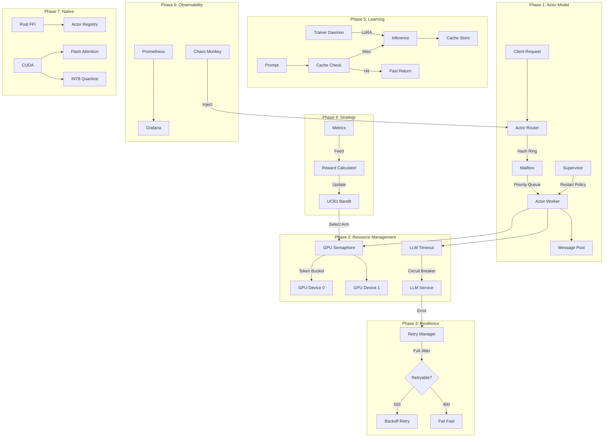
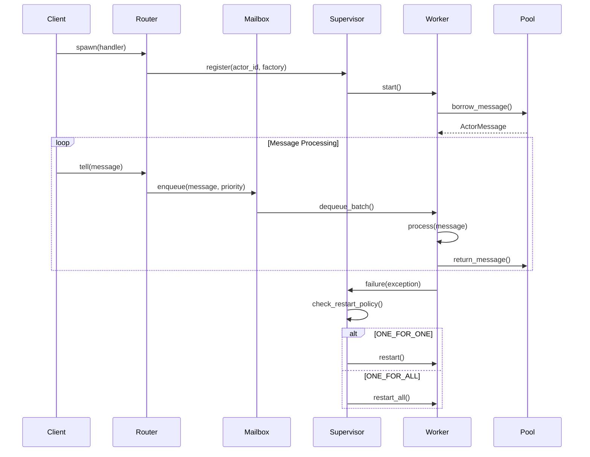

# Architecture Overview

## Design Principles

Kiro Protocol v3.0 follows these core design principles:

1. **Relentless Optimization**: Every millisecond matters. Batch operations, pre-compute, cache aggressively.
2. **Lock-Free by Default**: Sharded locks, atomic operations, lock-free data structures.
3. **Memory First**: Object pooling, __slots__, zero-allocation hot paths.
4. **Graceful Degradation**: Circuit breakers, backpressure, fallback strategies.
5. **Observable Everything**: Metrics, tracing, chaos testing for validation.

## System Architecture



## Data Flow

### Inference Request Flow

1. **Request Ingress**: Client sends prompt to API
2. **Actor Routing**: Hash ring selects actor worker
3. **Priority Enqueue**: Message placed in priority mailbox (CRITICAL > HIGH > NORMAL > LOW > BACKGROUND)
4. **Cache Check**: Precognition cache checks for exact or semantic match
5. **GPU Acquisition**: Token-bucket semaphore acquires GPU slot
6. **Strategy Selection**: UCB1 bandit selects best GPU strategy based on historical rewards
7. **LLM Call**: Circuit breaker protected, timeout managed, retry enabled
8. **Result Processing**: Post-process, cache result, record metrics
9. **Response**: Return to client with latency metadata

### Actor Lifecycle



## Component Interaction

### Actor System + GPU Semaphore

```python
async def inference_actor(msg):
    # 1. Check cache (Phase 5)
    cached = await cache.get(msg.prompt)
    if cached:
        return cached
    
    # 2. Select strategy (Phase 4)
    strategy = bandit.select_arm()
    
    # 3. Acquire GPU (Phase 2)
    async with gpu_semaphore:
        # 4. Call LLM with protection (Phase 3)
        result = await retry_manager.execute(
            lambda: llm_timeout.call(generate, msg.prompt)
        )
    
    # 5. Cache and record (Phase 5, 6)
    await cache.put(msg.prompt, result)
    metrics.counter("inference").inc()
    
    return result
```

## Performance Characteristics

| Component | Throughput | Latency (p99) | Memory |
|-----------|-----------|--------------|--------|
| Actor Router | 500K msg/s | 10μs | 2MB |
| Priority Mailbox | 100K msg/s | 50μs | 10MB |
| GPU Semaphore | 10K acquire/s | 100μs | 1MB |
| Precognition Cache | 50K lookup/s | 20μs | 500MB |
| UCB1 Bandit | 1M selects/s | 5μs | 100KB |
| Rust FFI Registry | 2M ops/s | 2μs | 5MB |

## Scaling Model

### Horizontal Scaling
- Actor workers scale across CPU cores
- GPU semaphore handles multiple devices
- Cache shards across instances
- Bandit instances per GPU device

### Vertical Scaling
- Rust FFI for CPU-bound operations
- CUDA kernels for GPU-bound operations
- Lock-free structures for contention reduction
- Object pooling for allocation reduction

## Failure Modes

| Failure | Detection | Mitigation |
|---------|-----------|------------|
| Actor crash | Supervisor heartbeat | ONE_FOR_ONE restart |
| GPU OOM | Memory pressure signal | Queue backpressure |
| LLM timeout | Adaptive timeout | Circuit breaker |
| Cache miss | Miss rate spike | Precognition prefetch |
| Strategy poor | Low reward signal | Bandit exploration |
| GC pause | Pause time metric | Freeze + background |
| Network partition | Health check failure | Retry with jitter |